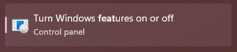
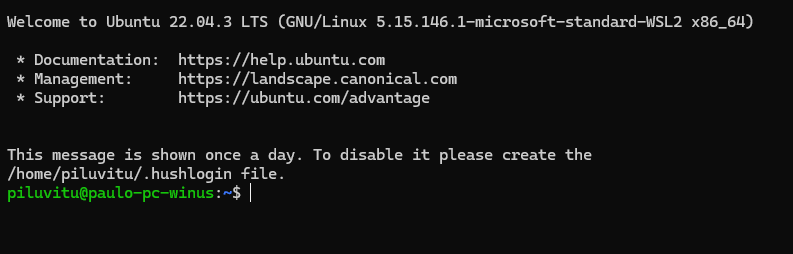
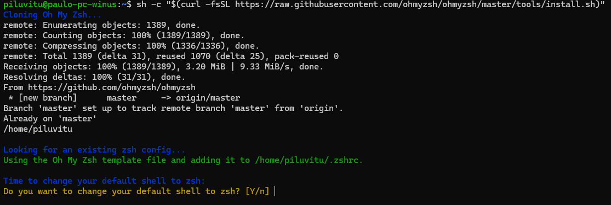
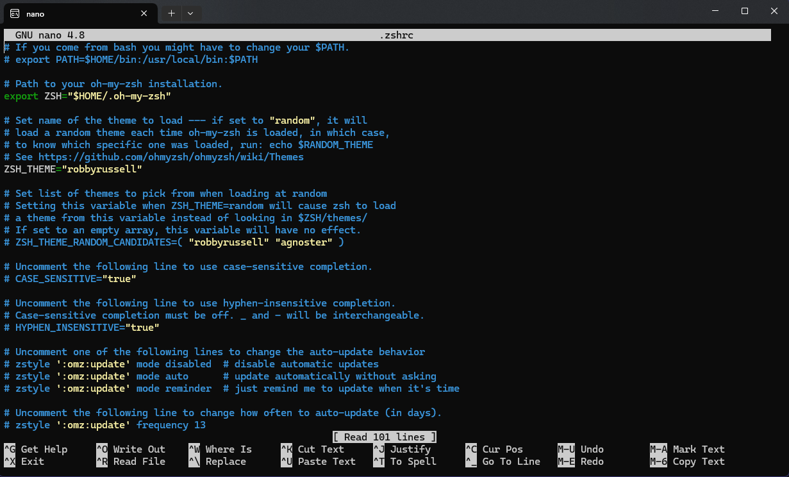
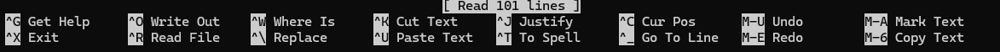
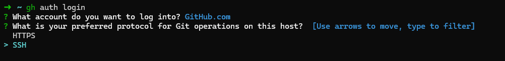
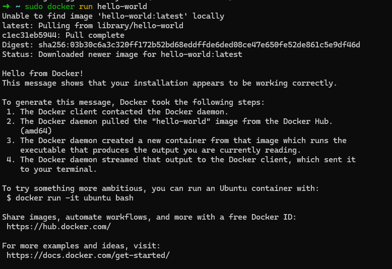
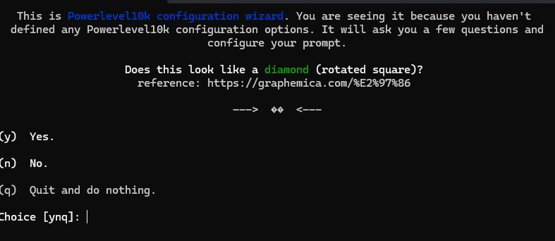
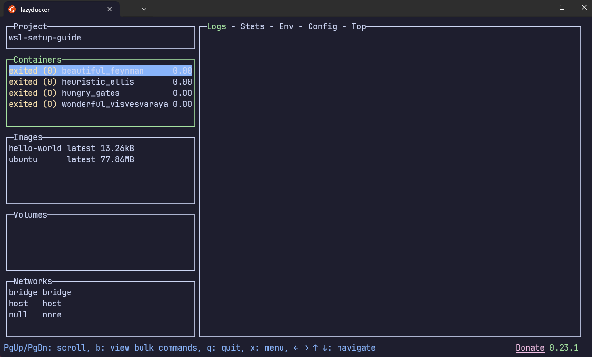

<h1>Sumário</h1>

- [Instale o WSL](#instale-o-wsl)
  - [Introdução](#introdução)
  - [Preparação](#preparação)
  - [Instalação](#instalação)
  - [Defina suas credênciais](#defina-suas-credênciais)
  - [Atualize suas dependências](#atualize-suas-dependências)
- [Shell](#shell)
  - [Oh My ZSH](#oh-my-zsh)
  - [Plugins para o Oh My ZSH](#plugins-para-o-oh-my-zsh)
- [Ferramentas](#ferramentas)
  - [NVM](#nvm)
    - [Instale a versão lst mais recente](#instale-a-versão-lst-mais-recente)
  - [PNPM](#pnpm)
    - [Alias Pn](#alias-pn)
  - [CLI GITHUB](#cli-github)
    - [Instalar o CLI](#instalar-o-cli)
    - [Logar no GitHub](#logar-no-github)
    - [Complete command](#complete-command)
  - [Docker](#docker)
    - [Instalação](#instalação-1)
    - [Limpar de package](#limpar-de-package)
    - [Definição do repo do docker](#definição-do-repo-do-docker)
    - [Instalar ultima versão](#instalar-ultima-versão)
    - [Instalar versão especifica](#instalar-versão-especifica)
    - [Verificando](#verificando)
  - [ASDF](#asdf)
    - [Instalação](#instalação-2)
  - [Go](#go)
    - [Instalação](#instalação-3)
- [Parabêns](#parabêns)
- [Dicas e Sugestões](#dicas-e-sugestões)
  - [Comandos de Terminal](#comandos-de-terminal)
  - [Terminal mais bonito](#terminal-mais-bonito)
  - [Alias git](#alias-git)
  - [Alias para stop de container](#alias-para-stop-de-container)
  - [Transferir wsl para outro disco](#transferir-wsl-para-outro-disco)
  - [Lazygit](#lazygit)
  - [Lazydocker](#lazydocker)
- [Melhor vilsualição do git log](#melhor-vilsualição-do-git-log)

# Instale o WSL

## Introdução

Seja bem vindo(a) a esse guia de como instalar e configurar o básico de wsl no windows, aqui nos vamos aprender a instalar, configurar e personalizar o seu wsl

## Preparação

Para começar vamos garantir que você está no ambiente certo para usar todo poder do wsl

- Você precisará estar no Windows 10 Build 19044+ ou Windows 11
- Driver instalado para vGPU

  - [GPU Driver da Intel](https://www.intel.com/content/www/us/en/download/19344/intel-graphics-windows-dch-drivers.html)
  - [GPU Driverda AMD](https://www.amd.com/en/support)
  - [GPU Driver da NVIDIA](https://www.nvidia.com/Download/index.aspx?lang=en-us)

- Pesquise por 'Ativar ou desativar recurso do windows' como mostra a imagem abaixo

 

- Acesse essa opção e ative os seguintes recursos


 

 

## Instalação

Agora estamos prontos para intalar o wsl, abra o seu powershell em modo **ADMIN** e digite o seguinte comando:

```powershell
wsl --install
```

> **REINICIE O PC DEPOIS DESSA INSTALAÇÃO**

## Defina suas credênciais

Inicie o seu _Ubuntu_:


Ele vai pedir para você definir as suas credenciais:


Insira seu nome de usuario e uma senha simples e rápida, você vai usar ela para executar comandos recorrentes, então não pode ser muito complexa e grande

> **ATENÇÃOOO:** A SENHA NÃO APARECE A MEDIDA QUE VOCÊ DIGITA, essa é uma medida de segurança que o ubuntu tem, fique atento na hora de digitar a sua senha.

Após definir as suas credenciais você vai estar em uma tela parecida com essa:



## Atualize suas dependências

A partir de agora você está dentro do seu wsl, a primeira coisa que devemos fazer ao entrar nesse sistema é rodar os seguintes comandos:

```bash
sudo apt update && sudo apt upgrade
```

Esses comandos vão atualizar a sua maquina e deixar ela pronta para uso, se lembra daquela senha que definimos na [sessão acima?](#defina-suas-credênciais) É ela que vamos usar para confirmar os comandos com o inicio `sudo`.

> Caso queira se aprofundar mais sobre a instalação inicial do linux acesse o link abaixo:
>
> [Instalar o WSL | Microsoft Learn](https://learn.microsoft.com/pt-br/windows/wsl/install)

# Shell

O _Ubuntu_ por padrão vem com o _Shell_ base mais famoso e usado pelas distro linux ao redor do mundo o `Bash`, mas nessa seção vamos ensinar a você instalar o `ZSH`.

> Caso queira saber mais sobre a escolha do ZSH ao inves do Bash e até aprender mais sobre Shell voce pode conferir os links a baixo:
>
> [Zsh X Bash](https://www.educba.com/zsh-vs-bash/)
>
> [O que é um Shell?](https://diolinux.com.br/tecnologia/entenda-o-que-e-bash-fish-zsh.html)

Vamos instalar o zsh com o seguinte comando:

```bash
sudo apt install zsh
```

Agora vamos fechar o terminal e abrir novamente e provavelmente paraecerá a seguinte tela para você:


> Se por algum acaso não aparecer, sem problemas, vamos resolver isso no prox passo

## Oh My ZSH

Agora vamos intalar um dos grandes motivos de usar zsh, oh my zsh é plugin que facilita muito a nossa vida com possibilidades de autocomplete, lista de comandos e personalização para deixar o terminal do seu jeito, rode o comando abaixo e ele vai baixar o `OhMyZsh`:

```bash
sh -c "$(curl -fsSL https://raw.githubusercontent.com/ohmyzsh/ohmyzsh/master/tools/install.sh)"
```

Apos inserir o comando vai aparecer a seguinte tela para você:


É só apertar a tecla `Y` para definir o zsh como shell padrão e seu terminal deverá ficar assim:


## Plugins para o Oh My ZSH

Com o shell configurado poderemos adicionar plugins para facilitar e auxiliar no nosso dia a dia de desenvolvimento.

Execute o seguinte comando no terminal para baixar os plugins na sua maquina

> Caso queira mais pugins, acesse esse [link](https://github.com/ohmyzsh/ohmyzsh/tree/master/plugins) e instale o de sua preferência

```bash
git clone https://github.com/zsh-users/zsh-autosuggestions.git $ZSH_CUSTOM/plugins/zsh-autosuggestions && git clone https://github.com/zsh-users/zsh-syntax-highlighting.git $ZSH_CUSTOM/plugins/zsh-syntax-highlighting && git clone https://github.com/zdharma-continuum/fast-syntax-highlighting.git ${ZSH_CUSTOM:-$HOME/.oh-my-zsh/custom}/plugins/fast-syntax-highlighting && git clone --depth 1 -- https://github.com/marlonrichert/zsh-autocomplete.git $ZSH_CUSTOM/plugins/zsh-autocomplete
```

Agora precisamos adicionar no seu .zshrc os plugins, no linux podemos abrir qualquer arquivo com editores que temos na nossa maquina, por padrão o Ubuntu vem com o `nano`, mas podemos usar o `VsCode`(Se estiver instalado).

Todas as suas configuraçoes de shell vão ficar centralizadas no arquivo `.zshrc` que fica localizado na raiz do seu linux, por padrão você sempre inicia na raiz do seu linux, mas caso esteja dentro de uma pasta e queira voltar rápidamente ou só garantir que está na raiz do linux insira o comando `cd` no seu terminal e aperte a tecla `Enter`, se o seu terminal estiver como a imagem abaixo, vc está na raiz:


A partir dela vamos inserir o seguinte comando:

```bash
nano ~/.zshrc
```

O seu terminal deve ficar assim agora:


Seja bem vindo ao `nano` um editor de texto padrão do linux, não é segredo como usar ele, apenas olhe para a parte inferior no terminal e verá os comando do nano:


No nano a o caractere `^` representa a tecla `Ctrl`

Digite `Ctrl + W` e digite `plugin`, você deve se atentar a seguinte parte do arquivo:


Subistitua onde tem `plugins=(git)` pelo código abaixo:

```zshrc
plugins=(git zsh-autosuggestions zsh-syntax-highlighting fast-syntax-highlighting zsh-autocomplete)
```

Vai ficar da seguinte maneira:


É recomendado reiniciar o terminal toda vez que você altera esse arqivo ou instala alguma coisa importante no seu linux, usando o seguinte comando:

```bash
source /home/seuUser/.zshrc
```

> Se você quiser definir um alias com o nome `reset` > `alias reset="source /home/seuUser/.zshrc"`

# Ferramentas

Essas daqui são algumas das ferramentas mais utilizadas pela minha pessoa, caso não se interesse por alguma ignore e continue o tutorial

## NVM

Node version manager é hoje a melhor e mais rápida opção para se instalar o node na sua maquina

Rode o seguinte comando no seu terminal para

```bash
curl -o- https://raw.githubusercontent.com/nvm-sh/nvm/v0.39.7/install.sh | bash
```

Após rodar o comando de instalação e a mesma tiver acabado, rode o comando `reset` para aplicar as novas mudanças no seu terminal e conseguir usar o `nvm` corretamente

### Instale a versão lst mais recente

Vamos rodar um comando no terminal para poder instalar a versão mais recente do node LTS

```bash
nvm install --lts
```

> Caso queira saber mais sobre o nvm e seus comando, [clique aqui](https://github.com/nvm-sh/nvm?tab=readme-ov-file#long-term-support)

## PNPM

O node por padrão vem com o `npm` como seu gerenciador de pacotesm, mas o pnpm veio para ser mais rápido e otimizado que o npm.

Para instalar ele, rodamos o seguinte comando:

```bash
npm i -g pnpm
```
Para instalar uma versão especifica informe a versão base especific:
```bash
npm i -g pnpm@8
```

### Alias Pn

Esse é um alias que pode ser inserido no `.zshrc` para 'facilitar' o seu uso.

```zshrc
alias pn=pnpm
```

Rode o comando `reset` e já pode usar o pnpm

> Caso queira saber mais [clique aqui](https://pnpm.io/7.x/motivation)

## CLI GITHUB

Uma grande parte das pessoas usam o github como local para armazenas seus códigos, sejam no trabalho ou estudo, se você é estudante e não coloca seus codigos no github, é interessante que tu bote.
A cli do github foi criada para conseguirmos fazer o que fazemos na web com alguns comando no terminal, como criar um repositório, clonar a branch de um PR e assim por diante

### Instalar o CLI

Para instalar rode o seguinte comando no terminal:

```bash
(type -p wget >/dev/null || (sudo apt update && sudo apt-get install wget -y)) \
&& sudo mkdir -p -m 755 /etc/apt/keyrings \
&& wget -qO- https://cli.github.com/packages/githubcli-archive-keyring.gpg | sudo tee /etc/apt/keyrings/githubcli-archive-keyring.gpg > /dev/null \
&& sudo chmod go+r /etc/apt/keyrings/githubcli-archive-keyring.gpg \
&& echo "deb [arch=$(dpkg --print-architecture) signed-by=/etc/apt/keyrings/githubcli-archive-keyring.gpg] https://cli.github.com/packages stable main" | sudo tee /etc/apt/sources.list.d/github-cli.list > /dev/null \
&& sudo apt update \
&& sudo apt install gh -y
```

### Logar no GitHub

É necessário logar com usa conta do github, necesse processo de login, o github cli nos ajuda cadastrando uma chave ssh, que ja vai ficar integrada no nosso wsl, para começar o processo rode o comando a seguir no terminal:

```bash
gh auth login
```


Na segunda etapa da configuração é importante que você selecione a opção `SSH`, pois ela é a responsavel por conseguimos cadastrar uma chave ssh de maneira facilitada

Na quarta etapa de configuração você pode escolher ter uma senha para sua chave `SSH` ou não, eu particularmente recomendo não ter, pois toda vez que voce realizar um commit ela vai pedir confirmação:

Por fim basta selecionar o tipo de autenticação que deseja usar para validar sua conta:

Finalizando essa etapa, recomendo fortemente que defina seu nome e email(de preferencia o mesmo do github) nas configuraçoes do git:

```bash
git config --global user.name "Seu Nome"

git config --global user.email "seuemail@exemplo.com"
```

Caso você use o vscode como seu editor de código principal, recomendo fortemente definir ele como seu editor padrão do git:

```bash
git config --global core.editor "code --wait"
```

[Manual | GitHub CLI](https://cli.github.com/manual/)

### Complete command

Se você quiser ter uma lista facilitada dos comandos da github cli, rode o comando `sudo su` para entrar no super terminal do linux e digite o seguinte comando:

```bash
gh completion -s zsh > /usr/local/share/zsh/site-functions/_gh
```

Rode o comando `exit` para sair desse terminal, agora vá até o nosso arquivo de configuração do bash(`.zshrc`) e insira o comando a seguir nele:

```zshrc
autoload -U compinit
compinit -i
```

No final ele vai ficar assim no `.zshrc`:


Resete o seu terminal com o comando previamente configurado ou reinicie o terminal e digite `gh`, ela vai aparecer assim:


## Docker

Essa é uma das principais ferramentas para o gerenciamento de container no mercado.

### Instalação

Os passos que iremos fazer será para a configuração do docker em um ambiente ubuntu, caso queira fazer em outro SOLinux de sua preferência [acesse aqui](https://docs.docker.com/engine/install/).

### Limpar de package

Esse comando é necessário para remover algum package que vai conflitar com a instalação do seu docker cli

```bash
for pkg in docker.io docker-doc docker-compose docker-compose-v2 podman-docker containerd runc; do sudo apt-get remove $pkg; done
```

### Definição do repo do docker

Algumas intalações do linux são feitas com base em suas versões encontradas nos repositórios de cada projeto, agora iremos configurar o do docker:

```bash
# Add Docker's official GPG key:
sudo apt-get update
sudo apt-get install ca-certificates curl
sudo install -m 0755 -d /etc/apt/keyrings
sudo curl -fsSL https://download.docker.com/linux/ubuntu/gpg -o /etc/apt/keyrings/docker.asc
sudo chmod a+r /etc/apt/keyrings/docker.asc

# Add the repository to Apt sources:
echo \
  "deb [arch=$(dpkg --print-architecture) signed-by=/etc/apt/keyrings/docker.asc] https://download.docker.com/linux/ubuntu \
  $(. /etc/os-release && echo "$VERSION_CODENAME") stable" | \
  sudo tee /etc/apt/sources.list.d/docker.list > /dev/null
sudo apt-get update
```

### Instalar ultima versão

```bash
sudo apt-get install docker-ce docker-ce-cli containerd.io docker-buildx-plugin docker-compose-plugin
```

### Instalar versão especifica

Aqui você vai precisar listar as versões disponiveis

```bash
# List the available versions:
apt-cache madison docker-ce | awk '{ print $3 }'
```

Depois de escolher uma versão, copie o nome dela e jogue na variavel e rode o comando

```bash
# Variavel
VERSION_STRING=5:24.0.0-1~ubuntu.22.04~jammy

# Comando
sudo apt-get install docker-ce=$VERSION_STRING docker-ce-cli=$VERSION_STRING containerd.io docker-buildx-plugin docker-compose-plugin
```

### Verificando

Para verificar se a instalação foi um sucesso rode o comando `sudo docker run hello-world`, seu terminal vai ficar assim:


Eu recomendo fortemente que você rode o comando `docker run -it ubuntu bash`, para tentar usar o terminal dentro de uma imagem ubuntu, se surgir algum erro como esse:


Rode `sudo usermod -aG docker $USER` no terminal e reinicie o wsl pelo powershell admin com o comando `wsl --shutdown` e tente rodar novamente o comando do docker.

> Em alguns casos é preciso ficar ativando o docker toda vez que entrar no wsl, não necessito fazer isso, mas caso o seu linux exiba:
>
> `Cannot connect to the Docker daemon at unix:///var/run/docker.sock. Is the docker daemon running?`
>
> Você precisará rodar `sudo service docker start` toda vez que for usar o mesmo
>
> **É MUITO IMPORTANTE TOMAR CUIDADO PARA NÃO DEIXAR MUITOS CONTAINERS ATIVOS NO SEU PC**

## ASDF

Asdf é um gerenciador de versões de linguagens direto na sua cli, você consegue instalar go, ruby e node com ele.

### Instalação

```bash
git clone https://github.com/asdf-vm/asdf.git ~/.asdf --branch v0.14.0
```

Após rodar esse comando, adicione a seguinte linha de codigo no `.zshrc`

```zshrc
. "$HOME/.asdf/asdf.sh"
```

No deve ficar assim no seu `.zshrc`:


> Caso queira saber mais sobre o asdf [clique aqui](https://asdf-vm.com/)

## Go

**Golang**, linguagem criada pelo Google em 2009, destaca-se por sua **simplicidade, velocidade, confiabilidade e suporte à concorrência**. Ideal para diversos tipos de aplicações, desde servidores web até sistemas embarcados. Curva de aprendizado e menor quantidade de bibliotecas são pontos a serem considerados. Comunidade ativa e diversos recursos facilitam o aprendizado.

### Instalação

Pra instalar o GO vamos usar o [asdf](#asdf) previamente instalado

```bash
asdf plugin-add golang
asdf install golang 1.21.5
asdf global golang 1.21.5
asdf shell golang 1.21.5
```

Pra ver se está tudo ok e rode um `go version` se o retorno for parecido com o da imagem está tudo ok


# Parabêns

Agora você tem um WSL, configurado e pronto para contibuir com a comunidade opensource ou fazer seus projetos pessoais, saiba que a jornada no linux é cheia de altos e baixo, qualquer duvida pergunte para alguem em um forum/comunidade que participa e com certeza alguem vai te ajudar, caso queira adaptar esse guia para seu caso especifico é só clonar ele com o comando `` e ser feliz.

Muito obrigado por ficar até aqui, não deixe de ver a sessão abaixo.

Seguir [me siga](https://piluvitu.dev/) e siga a devhatt nas redes sociais

# Dicas e Sugestões

## Comandos de Terminal

Se você não tem muita experiencia com terminal ou nunca usou um linux na vida, vale a pena ver esse [artigo](https://www.hostinger.com.br/tutoriais/comandos-linux) e dar um confere em alguns dos comandos que vão te acompanhar pelo dia a dia no linux

## Terminal mais bonito

> Antes de começar esse processo recomendo fortemente instalar e configurar alguma fonte de sua preferencia do [nerdfonts](https://www.nerdfonts.com/), para suportar os icones do github

```bash
git clone --depth=1 https://github.com/romkatv/powerlevel10k.git ${ZSH_CUSTOM:-$HOME/.oh-my-zsh/custom}/themes/powerlevel10k
```

Subistitua o tema que está no `.zshrc` pelo `powerlevel10k/powerlevel10k` e deve ficar assim:

Restarte o seu terminal e ele aparecerá assim, conclua os passos de acordo com seu gosto


> Caso queira saber mais sobre o powerlevel10k [clique aqui](https://github.com/romkatv/powerlevel10k?tab=readme-ov-file#powerlevel10k)

## Alias git

```zshrc
alias g=git
alias ga='git add'
alias gb='git branch'
alias gc='git commit --verbose'
alias gd='git diff'
alias gf='git fetch'
alias gg='git gui citool'
alias gl='git pull'
alias gm='git merge'
alias gp='git push'
alias gr='git remote'
```

## Alias para stop de container

Esse comando para os containers em execução automaticamente sem destruir, a fim de preservar recursos do seu pc, é só adicionar ele no `.zshrc` e bau bau

```zshrc
alias docker-down='docker stop $(docker ps -a -q)'
```

## [Transferir wsl para outro disco](https://github.com/LpCodes/Moving-WSL-Distribution-to-Another-Drive)

## Lazygit

Uma interface gráfica para o git no terminal que pode te ajudar a identificar branchs, fazer cherrypick e até rebase

> O passo a passo a seguir será para a instalação no UBUNTU, caso queria instalar de outra forma, ou em outro ambiente linux, [clique aqui](https://github.com/jesseduffield/lazygit?tab=readme-ov-file#installation)

Rode o seguuinte comando no terminal:

```bash
LAZYGIT*VERSION=$(curl -s "https://api.github.com/repos/jesseduffield/lazygit/releases/latest" | grep -Po '"tag_name": "v\K[^"]\*')
curl -Lo lazygit.tar.gz "https://github.com/jesseduffield/lazygit/releases/latest/download/lazygit*${LAZYGIT_VERSION}\_Linux_x86_64.tar.gz"
tar xf lazygit.tar.gz lazygit
sudo install lazygit /usr/local/bin
```

Após a instalação resete se terminal e use o comando `lazygit` no seu terminal quando tiver dentro de um repositório q tem git e ele ficará assim:


> Para saber mais sobre os comandos do lazygit, [clique aqui](https://github.com/jesseduffield/lazygit?tab=readme-ov-file#features)

## Lazydocker

Dos mesmoas criadores de [lazygit](#lazygit) temos o lazydocker, que tem o intuito de ser uma interface gráfica para o docker no seu terminal, muito util para ver algum log ou se existe algum container que persistiu, deletar volumes facimente e outras funcionalidades

Podemos instalar o programa usando o [asdf](#asdf) que deixa tudo bem mais fácil, rode os seguintes comandos no terminal caso tenha o [asdf](#asdf) instalado:

```bash
asdf plugin add lazydocker https://github.com/comdotlinux/asdf-lazydocker.git
asdf list all lazydocker
asdf install lazydocker latest
asdf global lazydocker latest
echo "alias lzd='lazydocker'" >> ~/.zshrc
```

Após instalar no terminal rode o comando `lazydocker` e ele ficará assim:



> Para saber mais sobre os comandos do lazydocker, [clique aqui](https://github.com/jesseduffield/lazydocker?tab=readme-ov-file#cool-features)

# Melhor vilsualição do git log
Esse é um alias de uma visualição de git log, para o git, com ela será possivel se orientar de maneira mais facil, [clique aqui](https://gist.github.com/aalmeida00/b87181f76785b2413d06e56dc6c499db), cole o comando da 1 opção no linux e quando voc 